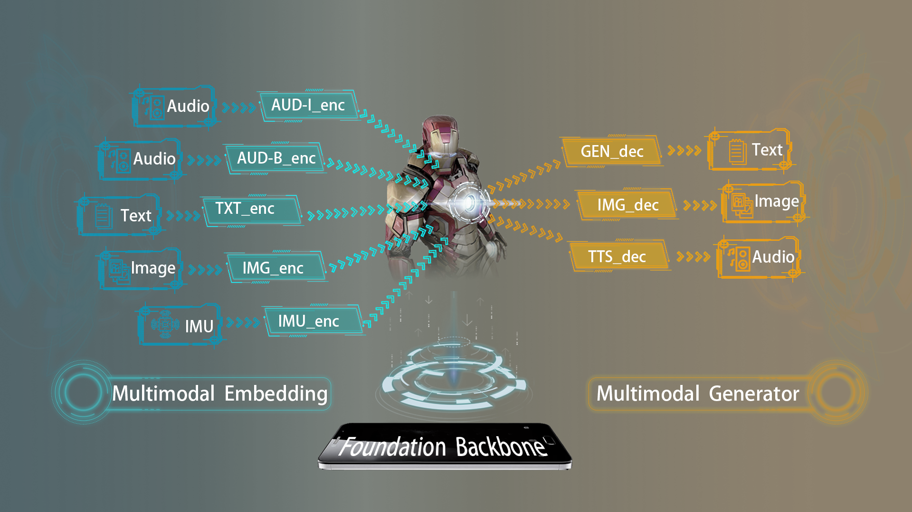

# Mobile Foundation Model as Firmware

## 1. Introduction

The architecture of our proposed M4, a one-size-fits-all foundation model
for diversified mobile/edge-oriented AI tasks. It is designed with the following principles: 
- unified: instead of building independent foundation models for different possible modalities, M4 provides a unified architecture that maximizes the capability
sharing across different modalities, thus being more resource-efficient and extensible;
- elastic: M4 can be easily scaled out to more modalities (either for input or output), e.g., for new types of sensor/app data;
- multimodal: M4 can take multimodal input or generate multimodal output as needed,
e.g., for advanced mobile applications like visual question answering or audio caption.


## 2. M4 Inference

The inference code for M4 on 50 tasks is stored in the `code/infer` directory. It is organized based on the underlying model into three folders: `path1`, `path2`, and `path3`. Each folder contains detailed instructions,  dependencies, and code for the inference of each task. Pretrained weights for each task are stored in the `pretrained_ckpt` path.

**Task Index**

| Path                      | Task                                                                |
| ------------------------- | --------------------------------------------------------------------|
| code/infer/path3         | T14, T15, T16, T18, ..., T31, T35, T36, T38, T39, T40, T46, T47, T48|
| code/infer/path2         | T1, T2, T3, ..., T13                                                |
| code/infer/path1         | T32, T33, T34, T37, T42, ..., T45, T49, T50                         |

<!-- 
| Path                      | Task                                        |
| ------------------------- | ------------------------------------------- |
| code/infer/ImageBind-LoRA | T21, T22, T23, T29, T35, T39, T40, T46, T47 |
| code/infer/llama-tasks    | T8                                          |
| code/infer/pandagpt-tasks | T49, T33, T34, T37                          |
-->
**Demo Example**

We use the Task-21 Optical Character Recognition as an example to demonstrate the inference process of M4.
```
cd code/infer/Path-3
```
To install the required environment, please run

```
conda create --name path3 python=3.8 -y
conda activate path3
pip install -r requirements.txt
```
Task-21 optical character recognition uses `Rendered SST2` dataset.
```
python t21-rendered.py
```
## 3. Benchmark Usage
The inference code for eAIBench, a comprehensive edge-oriented benchmark for AI tasks, is stored in the `code/Benchmark` directory. It is organized based on the underlying tasks or frameworks. Each folder contains detailed instructions,  dependencies, and code for the inference of each task. Pretrained weights for each task are stored in the `pretrained_ckpt` path.
**Demo Example**

We use the Task-1 Input Word Prediction as an example to demonstrate the inference process of eAIBench.
```
cd code/Benchmark
```
Install the Pytorch package with the correct cuda version, for example

```bash
pip install torch==1.13.1+cu117 -f https://download.pytorch.org/whl/torch/
```
Task-1 Input Word Prediction inference uses PTB dataset, and we already put it in [./WordPrediction/penn] directory.
```shell
cd MobileFM/code/Benchmark/WordPrediction
python test.py
```


## 4. Mobile Deployment


## 5. Future Work

Additional code for this project will be made available in the repository shortly. To facilitate understanding of the project, we have pre-created a file tree for the entire project. The training code will be uploaded to the `code/train` path, and the parameters for model training will be uploaded in YAML format to the `code/configs` path.
